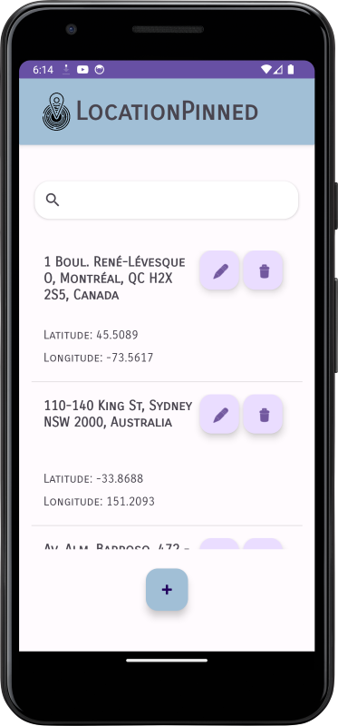
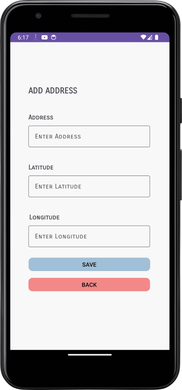

# Location-Displayer-App

### Screenshots

  
   

#### Functions
This application populates an SQLite database with 50 addresses, latitudes and longitudes on app creation. This is done by using a text file with latitudes and longitudes and using geocoding to get the address. Afterwards, these addresses are viewable in the main activity. 
